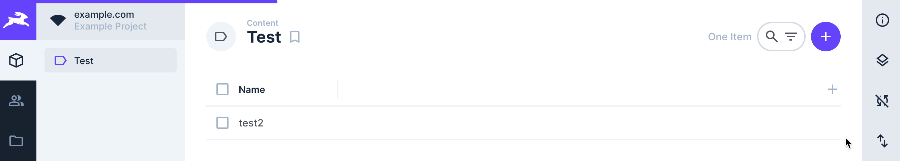
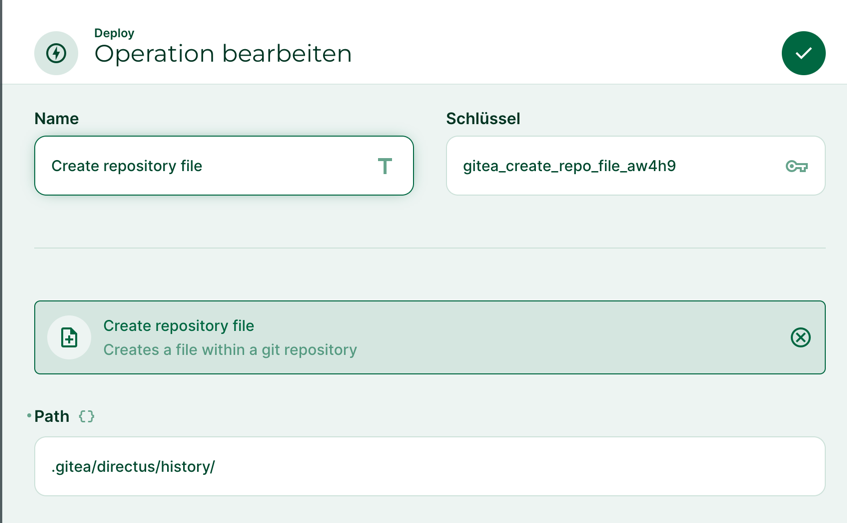
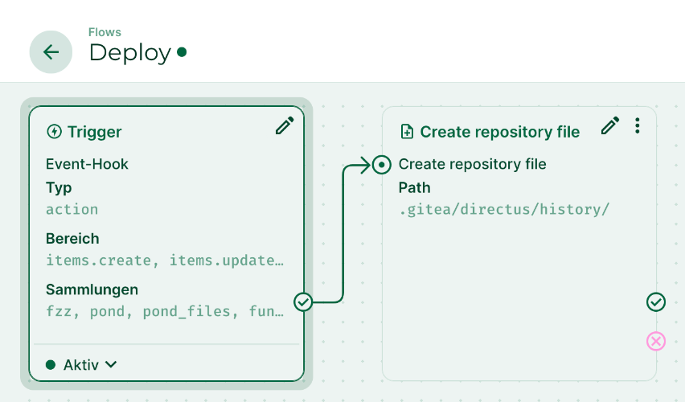

# Directus Gitea
An extension for [Directus](https://github.com/directus/directus) which integrates [Gitea](https://github.com/go-gitea/gitea) into directus.

## Idea of this project
This extension closes the gap between data edited in Directus and a Gitea action workflow in an environment
where a git commit triggers a build pipeline (e.g. for deploying application or website)  

Whenever data is changed in Directus the build pipeline should fetch data provided by Directus and
execute the Gitea action of the configured branch with the latest commit.  
Because Gitea doesn't provide a way to trigger an action via API (at the moment) this is achieved by adding a file to the repository. 

## Features
### Loading indicator in UI
Display loading indicator whenever a [Gitea Action](https://docs.gitea.com/usage/actions/overview) is in progress.  


### Create history files in git repository
A flow operation which allows to add a history file to the repository every time data is changed.  



## Installation
```shell
npm install directus-extension-gitea
```
## Configuration
Basic configuration of this extension is done via environment variables:

| Environment variable | Description                                                                             | Example                     |
|----------------------|-----------------------------------------------------------------------------------------|-----------------------------|
| GITEA_URL            | URL of Gitea server (without leading slash)                                             | https://git.myserver.com    |
| GITEA_TOKEN          | Access token of Gitea application (https://git.myserver.com/user/settings/applications) | asdfsadorasdfasdrwersdf876a |
| GITEA_REPO_OWNER     | Name of repository owner/organizaton                                                    | my_project                  |
| GITEA_REPO_NAME      | Name of repository                                                                      | my_app                      |
| GITEA_REPO_BRANCH    | Repository branch                                                                       | main                        |

The path for the created history files can be configured within the flow operation.
Example flow:


### Bar colors
Colors used in the bar are configured via default directus CSS variables.
For more information about directus CSS variables see official [directus docs](https://docs.directus.io/extensions/themes.html#project-styling).

| Status      | CSS variable |
|-------------|--------------|
| success     | --primary    |
| in-progress | --primary    |
| failed      | --danger     |
